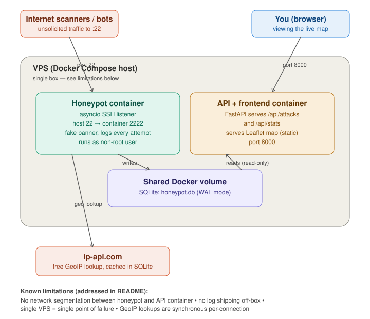

# SSH Honeypot Attack Map

A small SSH honeypot deployed on a public VPS. It logs every connection
attempt it receives, enriches each one with GeoIP data, and plots the
results on a live map.

Built for the Sprocket Security Jr DevOps take-home assessment ("a server
that does something").

**Live deployment:** http://64.227.8.159:8000



## Overview

1. **`honeypot/listener.py`** binds to a TCP port and presents itself as
   `OpenSSH_9.2p1`. It sends a real-looking SSH version banner, reads
   whatever the connecting client sends back (most scanners reply with
   their own SSH version string; some send raw `KEXINIT` bytes), and logs
   the source IP, port, timestamp, and payload to SQLite. It does not
   implement the real SSH protocol -- no key exchange, no authentication,
   nothing a connecting client can do besides get logged.
2. Each new source IP is enriched with a **GeoIP lookup** (via the free
   `ip-api.com` endpoint, cached in SQLite so repeat IPs aren't looked up
   twice).
3. **`api/main.py`** is a read-only FastAPI service exposing that data as
   JSON (`/api/attacks`, `/api/stats`) and serving the static frontend.
4. **`api/static/`** is a Leaflet map that polls the API and plots markers
   for incoming attacks, alongside a live feed and summary stats (top
   countries, top source IPs, attacks in the last hour).

The two services run as separate Docker containers (`honeypot`, `api`)
sharing one SQLite volume, orchestrated with Docker Compose.

## Running locally

```bash
docker compose up --build
```

- The honeypot listens on host port `2222` by default in this
  configuration (see `docker-compose.yml` -- the live deployment maps it to
  `22`).
- API + map: http://localhost:8000

To test, connect to the honeypot port directly:

```bash
nc localhost 2222
# returns a fake SSH banner; anything sent back is logged
```

Refreshing http://localhost:8000 should then show a new marker (assuming
the test connection resolves to a public IP -- loopback/private ranges are
deliberately excluded from GeoIP lookups).

## Deployment

1. Provision a VPS with Docker installed and a public IP.
2. Move the real SSH daemon off port 22 (e.g. to `2200`) and confirm access
   on the new port before proceeding -- this step has to happen first, or
   the honeypot's port mapping will conflict with the live SSH service.
3. Open the required ports in the firewall/security group: the new SSH
   port, `22` (honeypot), and `8000` (map). Close everything else.
4. Clone the repo onto the VPS and set the honeypot's port mapping in
   `docker-compose.yml` to `"22:2222"`.
5. `docker compose up -d --build`
6. The map is reachable at `http://<vps-ip>:8000`. Unsolicited scanning
   traffic typically starts arriving within minutes to hours of the port
   being exposed.

A reverse proxy (Caddy/nginx) with a TLS certificate would be the natural
next step for a real domain and HTTPS; left out here to keep the scope
appropriate for the assessment window (see Limitations).

## Design decisions

- **The honeypot never binds to port 22 as root.** It listens on an
  unprivileged port (`2222`) inside its container as a non-root user;
  Docker's host port mapping handles the privileged-port binding outside
  the container. None of the attacker-facing code runs with elevated
  privileges.
- **The API container mounts the shared volume read-only.** Even if the API
  layer were compromised, it has no ability to modify the honeypot's log.
- **GeoIP lookups are cached and skip private IP ranges** (`10.x`,
  `172.16.x`, `192.168.x`, `127.x`) so local or health-check traffic
  doesn't consume API calls or clutter the map.
- **SQLite with the default rollback journal**, rather than Postgres or
  Redis, keeps the stack to two containers. WAL mode was evaluated first
  for its write-concurrency benefits, but WAL requires a shared-memory
  index file that SQLite attempts to create even for read-only connections,
  which fails against a genuinely read-only volume mount. The default
  journal mode has no such requirement, and the honeypot's write volume
  doesn't need WAL's concurrency benefits in the first place.

## Notable issues found during deployment

Three issues surfaced moving from a local build to the live VPS deployment,
each illustrating a different container/permissions interaction that
doesn't show up when building and testing everything as a single local
user.

**Non-root container unable to write to its own volume.**
The honeypot runs as a non-root user by design. Docker creates named
volumes owned by `root` by default when nothing in the image pre-creates
the mount path, so the non-root process had no write access to `/data` and
crashed on startup. Resolved by creating `/data` and assigning it to the
`honeypot` user inside the Dockerfile, before the user switch -- when
Docker later mounts an empty named volume over that path, it inherits the
ownership already present at build time.

**API returning 500s against the read-only volume.**
The API's volume is intentionally mounted read-only, so it can never write
to the honeypot's log. Two separate issues stemmed from this:
- `sqlite3.connect()` requests read-write access by default even for a
  `SELECT`, which fails against a read-only mount. Resolved by connecting
  via a `file:...?mode=ro` URI instead.
- That alone was insufficient, because the honeypot was writing in WAL
  journal mode, which requires a shared-memory index file for coordination
  that SQLite attempts to create even for read-only connections -- also
  blocked by a read-only mount. Resolved by dropping WAL in favor of
  SQLite's default rollback journal (see Design decisions).

**"Attacks in the last hour" reporting a value close to the running total.**
Timestamps are stored via `datetime.now(timezone.utc).isoformat()`, e.g.
`2026-08-19T21:55:00.123456+00:00`. The stats query compared that directly
against SQLite's own `datetime('now', '-1 hour')`, which produces a
different string format (`2026-08-19 21:00:00` -- space separator, no `T`,
no offset). As a plain text comparison, and since `T` sorts after a space
character, nearly every timestamp from the current calendar day -- not
just the last hour -- evaluated as "greater than" the cutoff. Only entries
from a prior calendar day were excluded correctly. Resolved by wrapping
both sides in SQLite's `datetime()` function so both values are parsed and
normalized before comparison.

## Limitations and future work

Scoped intentionally small for the assessment window. Changes for a
production-oriented version:

- **No network segmentation.** The honeypot and API containers share a
  single Docker bridge network with no isolation between them. A
  production deployment would put the honeypot on its own network with no
  route to the API container, so that a honeypot-side compromise (e.g. via
  an asyncio/parsing bug) can't reach anything else.
- **No log shipping off-box.** All data lives in one SQLite file on one
  VPS; if the box goes down, the log goes with it. A durable deployment
  would ship logs off-box on write (S3, a log aggregator).
- **Single point of failure.** One VPS, one honeypot process, one
  database. Adequate for a demonstration; not for production monitoring.
- **GeoIP lookups are synchronous per-connection** against a free,
  rate-limited third-party API. Under a genuine burst (dozens of
  connections/sec) this would throttle or start dropping geo data. A local
  MaxMind GeoLite2 database would remove that dependency.
- **Only SSH is emulated.** Extending to Telnet, HTTP, or RDP honeypots
  would mean additional listeners writing to the same schema -- the
  architecture already supports this.
- **No alerting.** The map is a passive dashboard; nothing notifies on a
  traffic spike or a notable payload. A threshold-based webhook (Slack/
  Discord) would be a natural addition.
- **No authentication on the dashboard.** Anyone with the URL can view it.
  Acceptable for a portfolio piece; not for monitoring anything sensitive.

## Repository layout

```
sprocketInterview/
├── docker-compose.yml
├── honeypot/            # SSH honeypot listener (asyncio, SQLite, GeoIP)
│   ├── listener.py
│   ├── requirements.txt
│   └── Dockerfile
├── api/                 # FastAPI backend + static Leaflet frontend
│   ├── main.py
│   ├── requirements.txt
│   ├── Dockerfile
│   └── static/
│       ├── index.html
│       ├── app.js
│       └── style.css
└── diagram/
    └── architecture.svg
```
